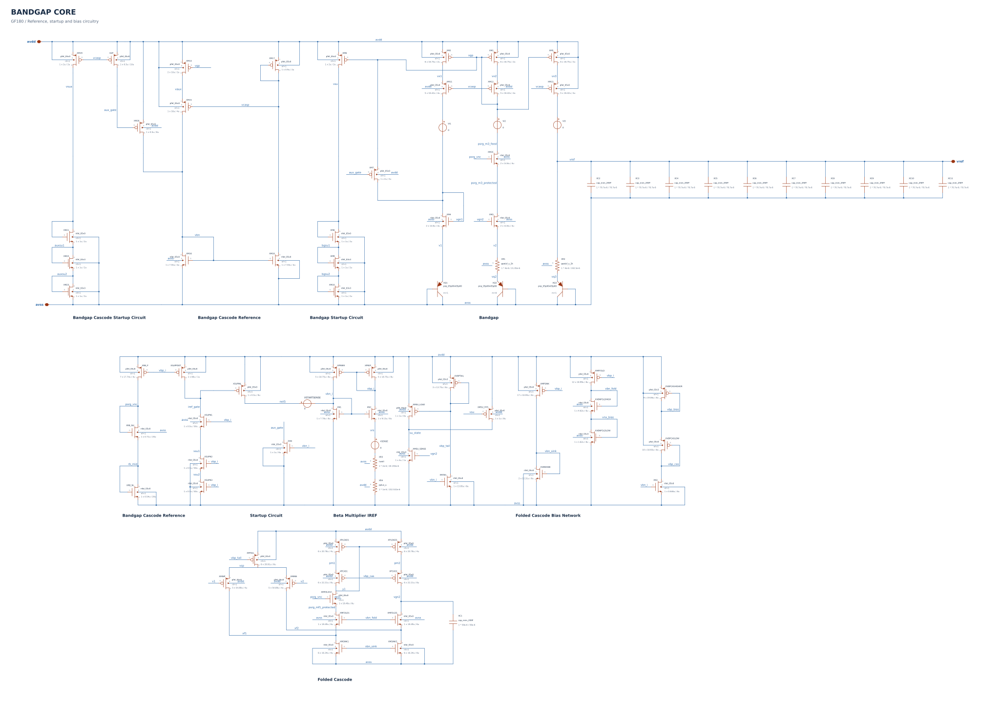
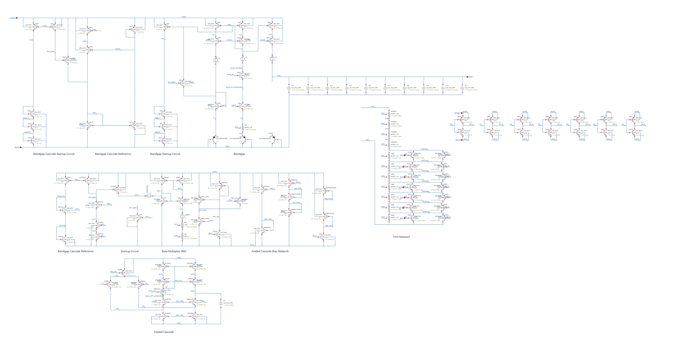

# Jonah Saunders Bandgap

A GF180MCU bandgap reference with a seven-bit resistor-trim network, targeting approximately **1.18 V** with low temperature drift.

[Specifications](#specifications) · [Schematics](#schematics) · [Installation](#installation-and-first-run) · **[Results](docs/RESULTS.md)** · [Testbenches](docs/TESTBENCHES.md)

<a id="projected-post-trim-specifications"></a>

## Specifications

Conservative planning estimates for the resistor-trim core, with a **1.18 V nominal goal**. Select the trim code for minimum temperature drift, then hold it fixed across supply and temperature. Min / Typical / Max entries are estimated values and design budgets, not measured or guaranteed limits.

| Parameter | Min | Typical | Max | Unit |
| --- | ---: | ---: | ---: | --- |
| Analog supply voltage | 3.3 | 3.3 | 5.0 | V |
| Trim logic supply voltage (fixed) | 3.3 | 3.3 | 3.3 | V |
| Operating temperature | −40 | 25 | 125 | °C |
| Output voltage after trim (1.18 V nominal) | 1.1682 | **1.184** | 1.1918 | V |
| Analog supply current | 15 | 30 | 60 | µA |
| Load regulation† | 0.1 | 0.5 | 1 | % |
| Line regulation, 3.3-5.0 V | 0.01 | 0.02 | 0.1 | % |
| Output noise density at 1 kHz | 900 | 1,500 | 3,000 | nV/√Hz |
| Integrated noise, 0.1-10 Hz | 50 | 70 | 100 | µV RMS |
| Initial output error relative to 1.18 V | −1 | +0.36 | +1 | % |
| PSRR at 1 kHz | 55 | 75 | 85 | dB |
| PSRR throughout 1 Hz-1 MHz | 45 | 50 | 55 | dB |
| Temperature coefficient after trim | 0.5 | 3 | **10** | ppm/°C |
| Startup / restart after supply ramp† | 75 | 200 | 300 | µs |
| PTAT output current† | 180 | 220 | 260 | nA |
| Trim resolution (fixed) | 7 | 7 | 7 | bits |

Typical values are rounded estimates near nominal conditions; the 1.184 V estimate reflects calibration for minimum drift rather than exact voltage. †Load regulation, PTAT current, and startup/restart at the new codes are provisional guesses. See **[Results](docs/RESULTS.md#basis-for-the-specification-estimates)** for the estimate basis and measured evidence.

## Schematics

### Bandgap core

The repaired core includes the reference, startup circuits, folded-cascode amplifier, bias network, and internal output capacitors.

[](docs/images/bandgap-core.svg)

[View full-size image](docs/images/bandgap-core.svg) · [Open Xschem source](Bandgap_Core.sch)

### Core with resistor trim

The trim version adds the physical resistor segments, bypass switches, and seven-bit control circuitry. This is the intended core for the trimmed-reference layout.

[](docs/images/bandgap-core-resistor-trim.svg)

[View full-size image](docs/images/bandgap-core-resistor-trim.svg) · [Open Xschem source](Bandgap_Core_Res.sch)

Both images are exported from the checked-in schematics. Click an image to inspect device labels and connections at full size.

## Installation and first run

### 1. Open the simulation environment

Use **Bash inside Linux/FOSS**, with Python 3.9+, Xschem, ngspice, and the GF180 symbol/model libraries installed. The runner uses POSIX file locks and does not run directly in Windows PowerShell. The PDK is installed separately.

In IIC-OSIC-TOOLS, use the full PDK selector in the same terminal before opening Xschem:

```bash
source /foss/tools/sak/sak-pdk-script.sh gf180mcuD
command -v python3 xschem ngspice
```

This sets `PDK`, `PDKPATH`, and ngspice startup settings together. The interactive alias is `sak-pdk gf180mcuD`; sourcing its script also works in Bash scripts. Repeat the selection in each new terminal.

The testbench model paths assume `/foss/pdks/gf180mcuD/libs.tech/ngspice/`. If your PDK is elsewhere, update each bench's `MODELS` paths before netlisting.

### 2. Get the project and Python dependencies

```bash
cd /foss/designs
git clone https://github.com/jonahsaunders/jonah_saunders_bandgap.git
cd jonah_saunders_bandgap

python3 -m venv .venv
source .venv/bin/activate
python3 -m pip install -r requirements.txt
python3 verify_suite.py
```

For an existing checkout, start in its repository folder. When reviewing an unmerged branch, switch to that branch before installation. Keep the core `.sch`/`.sym` files, benches, scripts, and `bandgap_config.json` together. The virtual environment is optional if NumPy and Matplotlib are already installed. Software checks do not simulate the circuit.

### 3. Configure the Xschem launchers

Close open testbenches, then run:

```bash
NETLIST_DIR="/headless/.xschem/simulations"
mkdir -p "$NETLIST_DIR"
python3 run_bandgap.py --configure --netlist-dir "$NETLIST_DIR"
```

Use your actual Xschem netlist directory. Reopen the benches afterward. Repeat this step after moving the repository; it updates launcher paths, not core circuitry or PDK model paths.

### 4. Run a smoke check

Generate TB01's netlist, run its short profile, and plot the results:

```bash
source /foss/tools/sak/sak-pdk-script.sh gf180mcuD
NETLIST_DIR="${NETLIST_DIR:-/headless/.xschem/simulations}"
mkdir -p "$NETLIST_DIR"
xschem -n -x -q -r -s -o "$NETLIST_DIR" \
  -N TB01_PSRR.spice TB01_PSRR.sch

python3 run_bandgap.py --test TB01_PSRR \
  --deck "$NETLIST_DIR/TB01_PSRR.spice" --profile smoke

python3 plot_bandgap.py --profile smoke --test TB01_PSRR
```

Check for missing-symbol or netlisting errors before running the Python command. The report is `results/smoke/TB01_PSRR_UPLOAD_THIS.txt`; plots are in `results/smoke/plots/`. Regenerate the matching netlist whenever its schematic changes.

For GUI runs, select GF180 and open a bench from that same terminal. Relaunch any Xschem window that previously loaded another PDK. Then click **Netlist**, then **Simulate**. Each schematic runs only its own bench. GUI profiles come from `bandgap_config.json`; the supplied defaults select **full**, including TB10. A terminal `--profile smoke` command does not change those defaults.

For the full-suite command, profile settings, troubleshooting, and **rerunning selected cases without replacing old results**, use the [simulation guide](docs/SIMULATION_GUIDE.md).
