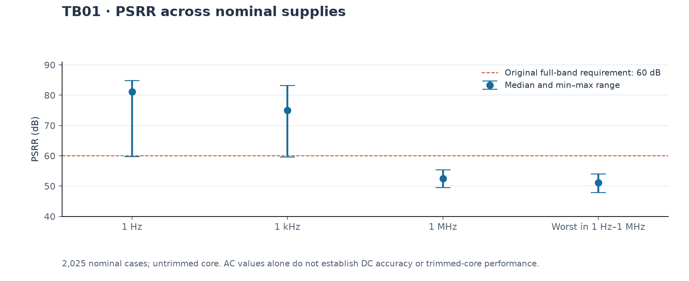
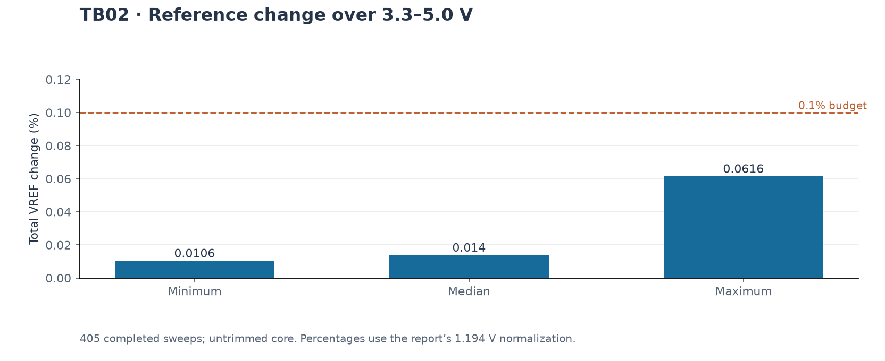
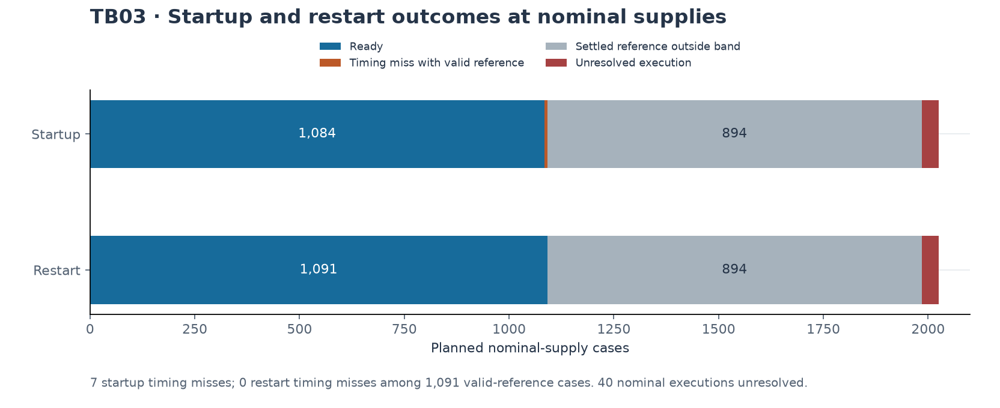
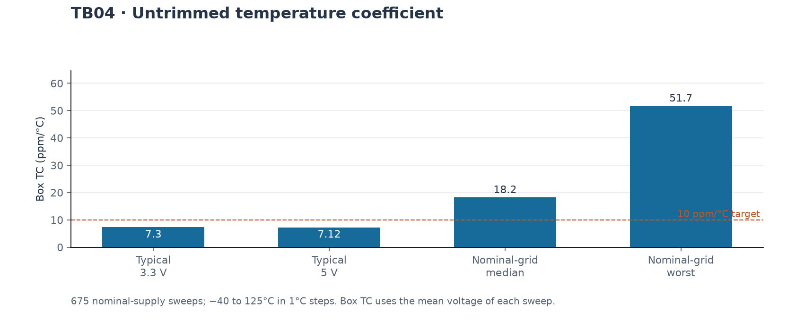
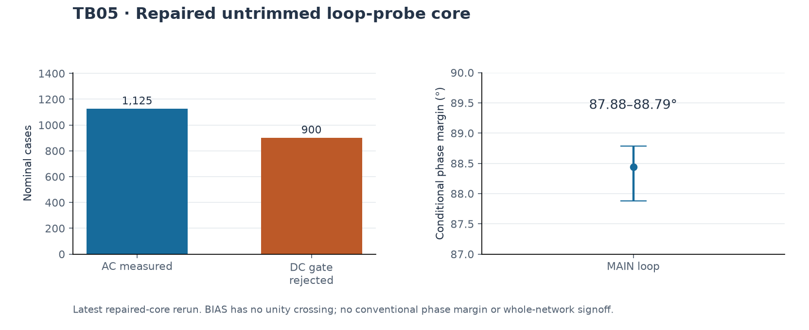
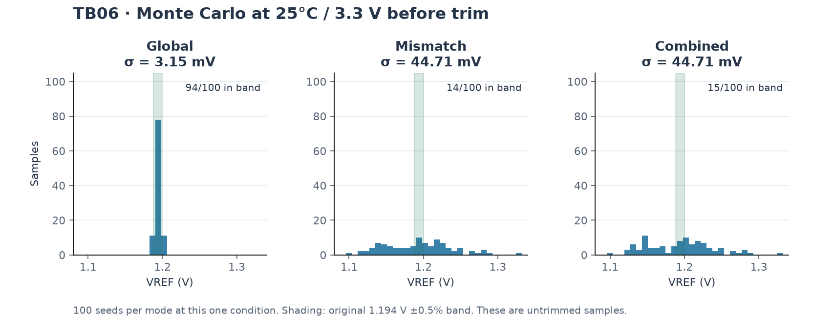
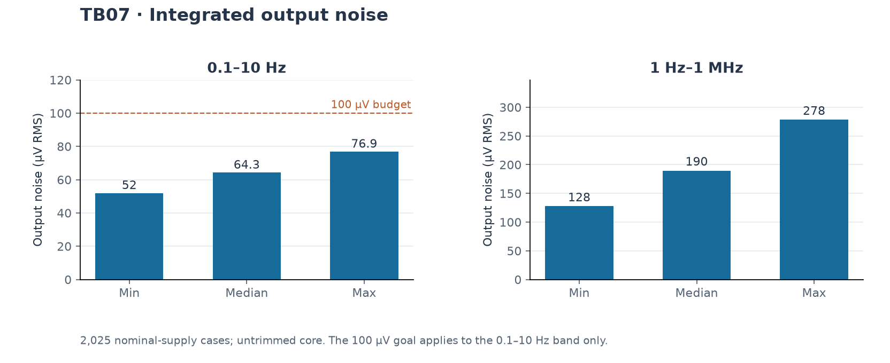
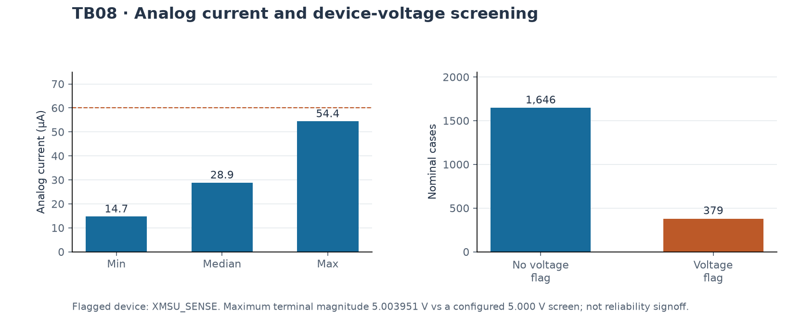
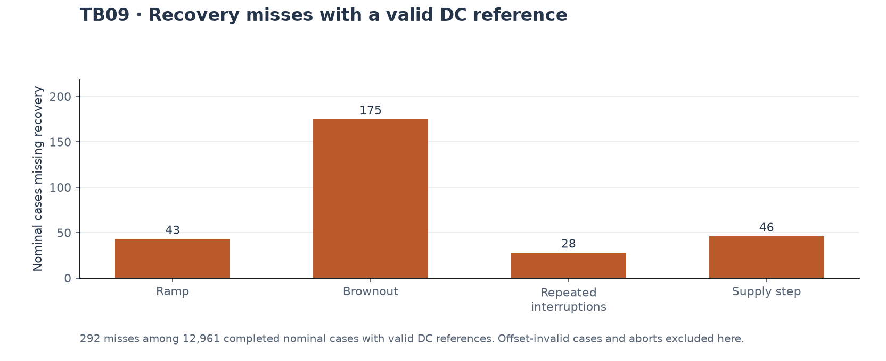
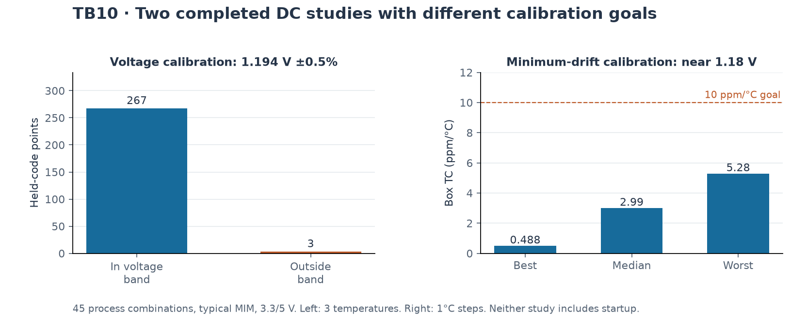

# Simulation results

[Overview](../README.md) · **Results** · [Testbenches](TESTBENCHES.md) · [Simulation guide](SIMULATION_GUIDE.md) · [Validation notes](../VALIDATION.md)

Pre-layout evidence from the saved **TB01–TB10** reports, including the **repaired-core TB05 rerun** and the later **TB10 DC and minimum-drift trim studies**. The project goal is a reference near **1.18 V**, with calibration chosen for low temperature drift. The standard full TB10 run still selects a code for **1.194 V at 25 °C**; see the [runner's acceptance criteria](TESTBENCHES.md#current-testbench-acceptance-targets) before comparing the workflows.

## TB01–TB10 report review

This review uses the **latest available evidence for each bench**, including the repaired-core TB05 rerun and all four TB10 studies. It was assembled from saved reports; no new circuit simulations were run to prepare this page.

[TB01](#tb01-psrr) · [TB02](#tb02-line-regulation) · [TB03](#tb03-startup-and-restart) · [TB04](#tb04-temperature) · [TB05](#tb05-repaired-core-loop-stability) · [TB06](#tb06-monte-carlo) · [TB07](#tb07-noise) · [TB08](#tb08-power-and-device-limits) · [TB09](#tb09-supply-disturbances) · [TB10](#tb10-physical-resistor-trim)

**How to read these results:** nominal AVDD is 3.3–5.0 V; 3.0 V and 5.5 V are stress points. Unless otherwise stated, performance figures below use the nominal range. The original benches evaluate **1.194 V ±0.5%**. The new project goal is approximately **1.18 V with trim chosen for minimum temperature drift**; it does not retroactively change those pass/fail results. A completed simulation is not necessarily a performance pass, and an unresolved simulation is not a proven circuit failure.

| Bench | Report used / execution coverage | Main finding |
| --- | --- | --- |
| TB01 — PSRR | Original full: **2,835/2,835 complete** | **47.82 dB** worst nominal full-band rejection; original 60 dB full-band target missed |
| TB02 — Line regulation | Original full: **405/405 sweeps complete** | **0.736 mV / 0.06165%** worst nominal span; supports the 0.1% line-regulation budget |
| TB03 — Startup/restart | Original full: **2,777/2,835 complete**, 58 unresolved | **7 startup timing misses** among 1,091 nominal cases with valid settled references |
| TB04 — Temperature | Original full: **945/945 sweeps complete** | **7.30 ppm/°C** typical at 3.3 V; **51.70 ppm/°C** worst nominal untrimmed box TC |
| TB05 — Loop stability | **Repaired-core rerun:** 1,575 complete; 1,260 DC-gate rejections | MAIN conditional PM **≥87.88° nominal**; BIAS has no unity crossing; overall stability is not certified |
| TB06 — Monte Carlo | Original full: **6,300/6,300 complete** | At 25 °C / 3.3 V, combined variation has **44.71 mV sample σ**; **15/100** meet the original voltage band before trim |
| TB07 — Noise | Original full: **2,835/2,835 complete** | **51.97–76.86 µV RMS** over 0.1–10 Hz; trimmed-core noise remains unverified |
| TB08 — Power/device limits | Original full: **2,835/2,835 complete** | **54.42 µA** maximum nominal current; **379** nominal device-screen flags need review |
| TB09 — Supply disturbances | Original full: **33,044/33,210 complete**, 166 unresolved | **292 recovery misses** among 12,961 completed nominal cases with valid DC references |
| TB10 — Physical trim | Nominal test, partial full run, **135/135 DC-screen bundles**, dense TC follow-up | Voltage-calibrated screen: **267/270** points meet ±0.5%; minimum-drift trim: **5.28 ppm/°C** worst in the later dense study |

TB01–TB04 and TB06–TB09 characterize the **untrimmed core**. TB05 uses the repaired **untrimmed loop-probe core**, as requested. TB10 uses the **physical resistor-trim core**. These are complementary results, not a complete qualification of the final trimmed layout.

### TB01: PSRR

All 2,835 simulations completed, including **2,025 nominal-supply cases**. The original criterion was at least 60 dB throughout 1 Hz–1 MHz; **none of the nominal curves meets that whole-band requirement**.

| Rejection metric | Minimum | Median | Maximum |
| --- | ---: | ---: | ---: |
| At 1 Hz | 59.75 dB | 81.16 dB | 84.74 dB |
| At 1 kHz | 59.52 dB | 75.05 dB | 83.22 dB |
| At 1 MHz | 49.49 dB | 52.48 dB | 55.29 dB |
| Each curve's worst value over 1 Hz–1 MHz | **47.82 dB** | 51.06 dB | 54.04 dB |

The worst nominal point is at approximately **35.48 kHz**, SS MOS / SS BJT / FF resistor / FF MIM, 125 °C, 3.3 V. The typical process at 25 °C / 3.3 V gives **75.03 dB at 1 kHz** and **50.54 dB worst in band**. Including stress supplies lowers the worst rejection to **45.85 dB**.

The measured AC values support the revised **55 dB at 1 kHz / 45 dB full-band** budgets. However, only **1,125/2,025** nominal cases satisfy the original DC reference band, so AC-budget compliance alone is not a full performance pass. Repeat trim-aware PSRR verification at the eventual selected codes.

View TB01 chart

### TB02: Line regulation

All **405 DC sweeps** completed. Within 3.3–5.0 V, the reference span is **0.126–0.736 mV**, with a **0.167 mV median**. The worst span is **0.06165%**, normalized to the original 1.194 V reference. All 405 sweeps are below the revised **0.1% line-regulation budget**.

The worst nominal combination is FF MOS / FF BJT / FF resistor, 125 °C, typical MIM. Extending the sweep to the stress range of 3.0–5.5 V increases the worst span to **2.000 mV**. Only **225/405** sweeps remain within the original absolute voltage tolerance throughout the nominal window: small supply sensitivity and correct absolute reference voltage are separate checks.

**Interpretation:** line regulation is encouraging. The full supply sweep still needs repeating at the minimum-drift trim codes; the two supply endpoints in the later TC study do not cover intermediate supply behavior.

View TB02 chart

### TB03: Startup and restart

The full run recorded **2,777 completed cases and 58 unresolved executions**. Of the **2,025 planned nominal-supply cases**, 1,985 completed and 40 were unresolved.

- **1,091 completed nominal cases** have valid pre-shutdown and final reference voltages.
- Among those, **1,084/1,091** meet startup readiness and **1,091/1,091** meet restart readiness within 300 µs.
- The **seven genuine startup timing misses** are at **3.3 V**, with SS MOS and SS resistor models, across selected BJT/MIM/temperature combinations. Their exact IDs are in the downloadable review data.
- Another **894 completed nominal cases** fail the settled reference-voltage criterion; these must not all be described as slow-start failures.
- Maximum nominal transient peaks are **1.481 V at startup** and **1.528 V on restart**, including cases outside the final accuracy band.

**Interpretation:** startup/restart is not fully qualified. The seven timing misses need attention separately from process-offset misses and simulator aborts. None of this validates startup at the new minimum-drift trim codes.

View TB03 chart

### TB04: Temperature

All **945 dense sweeps** completed, including **675 at nominal supplies**. Each sweeps −40 to 125 °C in 1 °C steps using the untrimmed core.

- Typical process box TC: **7.30 ppm/°C at 3.3 V** and **7.12 ppm/°C at 5 V**.
- Across nominal supplies: **4.15 ppm/°C best**, **18.19 ppm/°C median**, **51.70 ppm/°C worst**. Stress supplies reach **53.11 ppm/°C**.
- **150/675** nominal sweeps meet the original joint TC/accuracy criteria; **225/675** meet the absolute voltage criterion.
- Maximum nominal absolute voltage error is **1.717%** relative to 1.194 V; maximum analog current is **54.42 µA**.

These are **box TCs normalized by each sweep's mean voltage**. The report also contains a separate fixed-1.194 V normalization; those numbers are not interchangeable. The later **5.28 ppm/°C** result belongs to the physical-trim, minimum-drift study described under TB10, not this untrimmed run.

View TB04 chart

### TB05: Repaired-core loop stability

**The results here use `recheck_2026-09-28/full`, not the superseded original TB05 report.** The rerun attempted all **2,835 cases**: **1,575** produced loop measurements and **1,260** were rejected by the **1.194 V ±0.5% DC operating-point gate before AC analysis**. These 1,260 are not demonstrated oscillations or ngspice transient crashes.

For the **1,125 completed nominal cases**:

- MAIN conditional phase margin: **87.88–88.79°**, median **88.44°**.
- MAIN conditional gain margin: **44.21–49.91 dB**.
- BIAS has **no unity-gain crossing within the sweep**, so a conventional phase margin is not defined. Its low-frequency positive-feedback gain headroom is **1.72–2.83 dB**; that is not a phase margin.
- The recorded DC differences across both probe cuts are **0 V** for all completed cases.

Including stress supplies, minimum MAIN phase margin is **87.66°** and minimum BIAS headroom is **1.63 dB**. MAIN looks well behaved under the accepted operating points, but these are conditional measurements with the other loop closed. Rejected DC cases, the coupled-loop interpretation, and the resistor-trim core still require review. **Whole-network stability is not certified.**

View repaired-core TB05 chart

### TB06: Monte Carlo

All **6,300 DC cases** completed. The test reuses **100 seeds per mode** across supply/temperature conditions; these are not 6,300 independent manufactured-chip samples.

At **25 °C / 3.3 V**, with the **untrimmed core**:

| Statistical mode | Samples | Mean VREF | Sample σ | Within original ±0.5% band |
| --- | ---: | ---: | ---: | ---: |
| Global variation | 100 | 1.194013 V | **3.15 mV** | **94/100** |
| Local mismatch | 100 | 1.193589 V | **44.71 mV** | **14/100** |
| Combined | 100 | 1.193871 V | **44.71 mV** | **15/100** |

Across nominal supply/temperature points, the largest required output correction is **135.37 mV in combined mode** and **136.91 mV in mismatch-only mode**. Those are ideal correction requirements, not demonstrated resistor-trim corrections.

**Interpretation:** mismatch remains a major verification gap. Successful deterministic process-corner trimming does not establish post-trim mismatch yield. The physical trim must be selected per statistical sample and then held through temperature/supply checks. The histogram below uses one V/T condition so repeated seeds are not counted as independent chips.

View TB06 chart

### TB07: Noise

All **2,835 noise cases** completed, including **2,025 nominal-supply cases**. The nominal output-noise integrals are:

| Integration band | Minimum | Median | Maximum |
| --- | ---: | ---: | ---: |
| 0.1–10 Hz | **51.97 µV RMS** | **64.27 µV RMS** | **76.86 µV RMS** |
| 1 Hz–1 MHz | **127.53 µV RMS** | **189.73 µV RMS** | **278.16 µV RMS** |

The low-frequency integral supports the revised **100 µV RMS** budget. The original runner assigns **no numerical noise pass/fail threshold**; this comparison is a review of measured data against the later goal. Only **1,125/2,025** nominal cases have references within the original DC band. These results use the untrimmed core and installed PDK noise models; noise after physical trim and extraction remains unverified. A spectral-density value at one frequency and an integrated RMS value are different quantities.

View TB07 chart

### TB08: Power and device limits

All **2,835 cases** completed. Every **nominal case (2,025/2,025)** meets the **60 µA analog-current screen**: measured current spans **14.73–54.42 µA**, with a **28.87 µA median**. The 810 stress cases also meet the current screen. Current compliance does not imply voltage accuracy; only 1,125 nominal references meet the original DC band.

There are **379 nominal cases with device-voltage flags**, all involving **XMSU_SENSE**, against its configured **5 V screen**. The largest recorded terminal magnitude is **5.003951 V**, approximately **3.95 mV above the threshold**. Another **405 stress cases** contain voltage flags.

**Interpretation:** the current budget is supported. The small nominal exceedance should be reviewed at the affected DC operating points against actual device voltage rules and layout/ERC constraints; it is neither a demonstrated destructive violation nor a reliability signoff. These configured screens are not foundry absolute-maximum specifications.

View TB08 chart

### TB09: Supply disturbances

The run recorded **33,044 completed cases and 166 unresolved transients**. At nominal supplies, **23,369 completed and 121 were unresolved**. Of the completed nominal cases, **12,961** have a DC reference inside the original tolerance; **12,669** meet all recovery checks and **292** miss at least one.

| Scenario | Completed nominal cases with valid DC reference | Recovery passes | Recovery misses |
| --- | ---: | ---: | ---: |
| Supply ramp | 3,375 | 3,332 | **43** |
| Brownout | 6,698 | 6,523 | **175** |
| Repeated interruptions | 1,088 | 1,060 | **28** |
| Supply step | 1,800 | 1,754 | **46** |

Another **10,408 completed nominal cases** fail the baseline DC accuracy criterion. Those offset-related failures must be distinguished from the **292 recovery misses at otherwise valid DC points**. Of the latter, **124 occur at 3.3 V**. Maximum nominal overshoot above the target is **329.43 mV** across all completed cases and **310.37 mV** among cases with valid DC references.

**Interpretation:** disturbance recovery remains an open functional issue. Resistor trim may correct voltage offset, but it cannot be assumed to resolve recovery dynamics, overshoot, or simulator aborts.

View TB09 chart

### TB10: Physical resistor trim

There are **four separate pieces of TB10 evidence**. Their scopes and calibration objectives must remain distinct.

| Study | Coverage | Result |
| --- | --- | --- |
| Original nominal trim test | Typical process / 25 °C; 128 codes at 3.3 V and 5 V | Code **70**; both held-code DC points and all four startup/restart events pass |
| Partial full rerun | **36 of 405 planned bundles have final report records** | 12 bundles complete, 24 contain unresolved startup analyses; all **252 recorded held-code DC points** pass |
| Completed broad DC screen | **135/135 bundles**: 45 process combinations × 3 temperatures, two supplies, all codes | **267/270** held-code points meet the original voltage band; **270/270** are self-sustaining; no startup runs |
| Minimum-drift dense follow-up | 45 process combinations; 135 candidate-code jobs; −40 to 125 °C in 1 °C steps, two supplies | **2.54 ppm/°C typical**, **5.28 ppm/°C worst**; output near **1.18 V** |

#### Original nominal startup evidence

At code 70, VREF is **1.194454 V at 3.3 V** and **1.194605 V at 5 V**. Startup/restart times after the ramp are **213.4 / 141.0 µs at 3.3 V** and **121.5 / 80.7 µs at 5 V**. These results apply to that voltage-calibrated code, not the later minimum-drift selection.

#### What the interrupted full run actually contains

The saved full report has **36 final bundle records** and no final suite summary; it is not a completed 405-bundle qualification. The other 369 planned bundles have no final report record. Within the recorded bundles:

- **32,256 code-sweep DC points**, plus **4,608 calibration DC points**, were recorded.
- All **252 held-code DC points** meet the original accuracy and self-sustaining checks.
- Of **252 startup/restart transient runs**, **204 complete** and **48 remain unresolved**. All **408 events** from completed transients pass their readiness checks.
- Restricting to nominal supplies gives **156 completed and 24 unresolved transients**; all 312 events from completed nominal transients pass.

Thus, a bundle marked failed can still contain useful completed DC data. It must not be counted as a successful startup qualification.

#### Completed voltage-calibrated DC screen

The fast screen covers **5 MOS × 3 BJT × 3 resistor corners**, typical MIM, −40/25/125 °C, AVDD 3.3/5 V, and DVDD 3.3 V. It selects a code at **25 °C / 3.3 V toward 1.194 V**, then holds it fixed.

- **34,560 all-code DC points**, plus **11,520 separate calibration points**; all 135 bundles complete.
- Selected codes span **61–83**. Held-code outputs span **1.190078–1.200090 V**.
- **267/270** held-code points meet ±0.5%; all **270/270** meet the self-sustaining checks. Maximum absolute error is **0.5100%**.
- The three accuracy misses all occur at **125 °C / 5 V** and exceed the original upper voltage limit by approximately **68.6–119.7 µV**. They are small accuracy misses, not simulation crashes.
- Startup and restart were **deliberately omitted** from this screen, so it does not resolve the partial full run's 48 unresolved transients.

#### Minimum-drift calibration and the 1.18 V goal

The follow-up changes the selection objective to minimum temperature drift. Each process combination uses one code held across both supplies and all temperatures. **135/135 dense candidate jobs** complete; the final selections have **14,940 valid DC points**, use codes **65–98**, and produce **1.173776–1.189448 V** over the tested range. Box TC is **0.49 ppm/°C best**, **2.54 ppm/°C typical**, **2.99 ppm/°C median**, and **5.28 ppm/°C worst**.

This supports the revised approximately 1.18 V / ≤10 ppm/°C goals within the tested deterministic DC coverage. It does not prove post-trim mismatch yield, startup, PSRR/noise, or stability. The ordinary full TB10 runner still uses voltage calibration; it does not automatically reproduce the minimum-drift study.

View TB10 comparison chart

[Dense temperature curves and calibration details](results/trim-temperature-2026-09-28/README.md) · [Selected trim codes](results/trim-temperature-2026-09-28/selected_codes.csv)

### What remains before qualification

The strongest completed evidence is line regulation, current, the revised untrimmed PSRR/noise budgets, and minimum-drift trim capability at fixed process corners. The main unresolved items are **physical-trim mismatch coverage**, **startup/recovery misses**, **transient execution failures**, and **stability/PSRR/noise with the actual selected trim codes and extracted layout**.

The reported transient failures must also be considered alongside [ngspice issue #870](https://sourceforge.net/p/ngspice/bugs/870/), which describes an ngspice 46 diode sidewall-capacitance transition problem. The maintainer reports a fix in pre-master-48. That is relevant simulator context, not proof that every failed case has the same cause; the saved failures remain unresolved until reproduced and checked. The DC-gate rejections in TB05 are a different category.

### Source reports and reproducibility

| Evidence | Local saved report location |
| --- | --- |
| TB01–TB04, TB06–TB09 | `results/full/TBxx_NAME_UPLOAD_THIS.txt` |
| Authoritative repaired-core TB05 | `results/recheck_2026-09-28/full/TB05_LOOP_STABILITY_UPLOAD_THIS.txt` |
| Superseded TB05, retained only for history | `results/full/TB05_LOOP_STABILITY_UPLOAD_THIS.txt` |
| TB10 nominal | `results/trim_nominal/TB10_RESISTOR_TRIM_UPLOAD_THIS.txt` |
| TB10 partial full run | `results/recheck_2026-09-28/full/TB10_RESISTOR_TRIM_UPLOAD_THIS.txt` |
| TB10 completed broad DC screen | `results/trim_screen_2026-09-28/trim_screen/TB10_RESISTOR_TRIM_UPLOAD_THIS.txt` |
| TB10 dense minimum-drift follow-up | `results/trim_tc_2026-09-28/SUMMARY.json` and selected-code temperature traces |

[Download the review data and source hashes](results/testbench-review-2026-09-28/summary.json). The [report audit](results/testbench-review-2026-09-28/audit_reports.py) reads existing local reports only; the [chart generator](results/testbench-review-2026-09-28/plot_review.py) redraws figures from the published JSON. Neither launches a circuit simulation. Original reports and all prior results remain preserved locally; bulky raw report files are not duplicated in Git.

## Goals and available evidence

**Current pre-layout simulations support a reference near 1.18 V with a post-trim temperature-coefficient goal of ≤10 ppm/°C.** The calibration objective is minimum temperature drift: select one physical resistor-trim code for each chip using measurements at multiple temperatures, then hold it fixed across temperature and supply. **1.18 V is the nominal voltage goal, not an exact voltage that the calibration must force.**

The table distinguishes results from the physical trim core from earlier untrimmed-core measurements. Goals remain provisional until mismatch, remaining functional checks, and extracted-layout verification are complete.

| Parameter | Projected goal / operating condition | Simulation evidence available |
| --- | --- | --- |
| Reference voltage | **Approximately 1.18 V nominal** | **1.18425 V** at the typical process, 25 °C / 3.3 V, after selecting the code for minimum drift |
| Initial output accuracy | **±1% of 1.18 V** at 25 °C / 3.3 V; voltage is secondary to minimum drift | **1.17384-1.18927 V** across 45 fixed process combinations; mismatch coverage pending |
| Output accuracy across supply and temperature | **±1% of 1.18 V**: 1.1682-1.1918 V | **1.17378-1.18945 V** across the selected dense curves at 3.3 V and 5 V; intermediate supplies and mismatch pending |
| Analog supply, AVDD | **3.3-5.0 V**; 3.0 V remains a characterization goal | New trimmed-core temperature data covers the two nominal endpoints |
| Trim logic supply, DVDD | **3.3 V** | Held at 3.3 V throughout the trim screen |
| Temperature range | **−40 to 125 °C** | Verified at **1 °C steps** for the selected codes and neighboring candidates |
| Temperature coefficient | **≤10 ppm/°C** after calibration for minimum drift | **2.54 ppm/°C typical**, **2.99 ppm/°C median**, **5.28 ppm/°C worst** across the 45 process combinations and both supplies |
| Quiescent analog supply current | Approximately **30 µA typical**, **≤60 µA maximum**; DVDD current separate | **54.42 µA maximum** in the new selected-code temperature sweeps |
| Line regulation | **≤0.1% total VREF change** across 3.3-5.0 V at fixed temperature and code | **0.0616%** worst in the earlier untrimmed-core nominal-supply sweeps; a complete sweep at the new trim codes remains pending |
| Power-supply rejection | **≥55 dB at 1 kHz**, **≥45 dB throughout 1 Hz-1 MHz** | Earlier untrimmed-core minimum over the band: **47.8 dB**; trimmed-core verification pending |
| Output noise density | **≤3,000 nV/√Hz at 1 kHz** | Earlier untrimmed-core data informed this budget; trimmed-core verification pending |
| Integrated output noise | **≤100 µV RMS over 0.1-10 Hz** | Earlier untrimmed-core result: **52-77 µV RMS**; trimmed-core verification pending |
| Startup / restart readiness | Enter and remain within the reference tolerance **within 300 µs after the supply ramp** | New temperature screen is DC only; startup at the selected codes and unresolved transient cases remain pending |
| Trim control | **7 bits / 128 codes**, calibrated once and held fixed | Selected codes **65-98** in the new fixed-corner screen |

**Additional proposal goals without supporting measurements:** load regulation **≤1%** after an output-load range is defined, and a **220 nA nominal PTAT output current** after its measurement conditions are defined.

### Temperature-trim results — September 28, 2026

The new screen covers **45 process combinations** (5 MOS × 3 BJT × 3 resistor, with typical MIM), **−40 to 125 °C**, **3.3 V and 5 V AVDD**, and **3.3 V DVDD**. All 128 codes were first compared at −40, 25 and 125 °C. The best sampled code and its two neighbors were then checked at 1 °C steps: **135/135 candidate jobs completed**, producing **44,820 DC sample points**. The selected code is held across both supplies and all temperatures for each process combination. All **14,940 selected-code operating points** meet the existing self-sustaining DC current checks.

The left chart shows drift relative to each curve's own 25 °C output. The right chart shows the voltage tradeoff: each dot is one process combination, with its worst temperature coefficient across the two supplies. The corner previously giving **65.5 ppm/°C** when calibrated toward 1.200 V now gives **3.28 ppm/°C** with a different code. That earlier figure used only three temperatures; the new results use the dense sweep.

**These results support the revised goals; they are not a silicon guarantee or complete layout signoff.** A real chip needs calibration at multiple temperatures to select its minimum-drift code. Random mismatch, trimmed-core startup/restart, PSRR, noise, stability, and extracted-layout behavior remain to be qualified. These DC checks do not resolve the known transient simulator aborts.

[Result details and method](results/trim-temperature-2026-09-28/README.md) · [Selected codes and metrics (CSV)](results/trim-temperature-2026-09-28/selected_codes.csv) · [Full selected temperature curves (CSV)](results/trim-temperature-2026-09-28/selected_curves.csv)

## Basis for the specification estimates

The README's Min / Typical / Max table is a **planning estimate**, not a completed characterization table. Its columns combine intended operating conditions, rounded performance estimates, and padded design limits. The minimum column for quantities such as noise, drift, and current describes a plausible favorable value; it is not a guaranteed lower bound. For PSRR, a higher value is better. Actual measured results remain in the evidence table above and the downloadable data.

- **Supply, temperature, and digital controls:** AVDD 3.3-5.0 V and −40 to 125 °C are the intended operating ranges. DVDD is fixed at 3.3 V; repeating it in all three columns does not claim a characterized DVDD tolerance. The physical trim is always seven bits, so all three entries are seven.
- **Reference voltage and initial error:** the nominal goal remains 1.18 V, with a provisional ±1% budget (1.1682-1.1918 V). Minimum-drift calibration gives 1.184247 V at the typical process / 25 °C / 3.3 V. This is approximately +0.36% relative to 1.18 V, explaining the rounded 1.184 V typical estimate. Choosing a different code to force exactly 1.180 V would change the temperature drift.
- **Analog current:** 15 / 30 / 60 µA are rounded planning values. Earlier nominal-supply untrimmed results span approximately 14.7-54.4 µA, with a 28.9 µA median; the new selected-code temperature curves reach 54.42 µA. The 30 µA figure is a conservative nominal budget, not the exact typical-process DC current. DVDD current is separate.
- **Line regulation:** 0.01 / 0.02 / 0.1% are estimated total changes over 3.3-5.0 V. The untrimmed nominal-supply sweeps show approximately 0.0106% minimum, 0.0140% median, and 0.0616% maximum. Complete line sweeps at the newly selected trim codes remain pending.
- **Noise:** 900 / 1,500 / 3,000 nV/√Hz at 1 kHz and 50 / 70 / 100 µV RMS over 0.1-10 Hz are rounded estimates and budgets. Earlier untrimmed nominal-supply results are approximately 990-2,073 nV/√Hz and 52-77 µV RMS. Physical-trim noise and extracted-layout effects remain unverified; these estimated endpoints are not measured minima or maxima.
- **PSRR:** the 55 / 75 / 85 dB estimates at 1 kHz are informed by untrimmed nominal-supply results of approximately 59.5 / 75.0 / 83.2 dB (minimum / median / maximum). The 45 / 50 / 55 dB full-band estimates describe each curve's worst rejection throughout 1 Hz-1 MHz; the corresponding observed range is 47.8-54.0 dB. The low-end entries are design budgets, while upper entries are favorable estimates. Trimmed-core PSRR is still pending.
- **Temperature coefficient:** 0.5 / 3 / 10 ppm/°C uses the minimum-drift trim screen as its basis: approximately 0.49 ppm/°C best, 2.54 ppm/°C typical process, 2.99 ppm/°C median, and 5.28 ppm/°C worst. The 10 ppm/°C maximum is a provisional design budget rather than a claimed measured result or proven mismatch limit.
- **Startup/restart:** 75 / 200 / 300 µs are provisional estimates after the supply ramp. Earlier typical voltage-calibrated trim tests measured roughly 81-213 µs across startup/restart and the two supplies. The minimum-drift codes have not been checked for startup/restart, and earlier transient failures remain unresolved. The 300 µs value is still a target.
- **Load regulation and PTAT current:** 0.1 / 0.5 / 1% and 180 / 220 / 260 nA carry forward the original proposal as explicitly unverified guesses. The output-load range and PTAT-current measurement conditions must be defined before either row can become a specification.

The estimate update changes documentation only. It does not change the default runner's calibration, pass/fail criteria, device sizes, or model parameters, and it does not imply that a new simulation campaign was completed.
