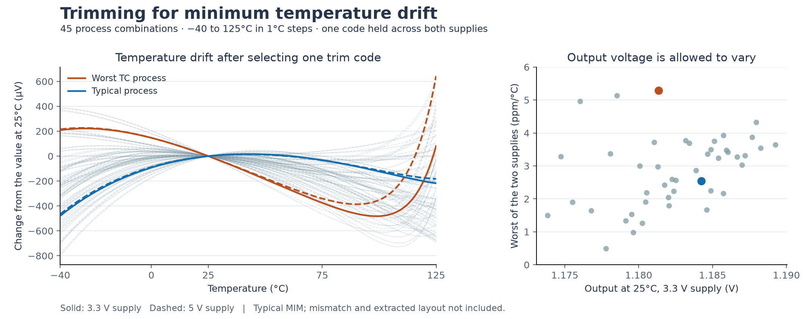

# Simulation results

[Overview](../README.md) · **Results** · [Testbenches](TESTBENCHES.md) · [Simulation guide](SIMULATION_GUIDE.md) · [Validation notes](../VALIDATION.md)

Pre-layout evidence for the revised **1.18 V** reference goals. The temperature-trim charts use a separate calibration for minimum drift; the standard full TB10 run still selects a code for **1.194 V at 25 °C**. See the [runner's acceptance criteria](TESTBENCHES.md#current-testbench-acceptance-targets) before comparing the two workflows.

## Goals and available evidence

**Current pre-layout simulations support a reference near 1.18 V with a post-trim temperature-coefficient goal of ≤10 ppm/°C.** The calibration objective is minimum temperature drift: select one physical resistor-trim code for each chip using measurements at multiple temperatures, then hold it fixed across temperature and supply. **1.18 V is the nominal voltage goal, not an exact voltage that the calibration must force.**

The table distinguishes results from the physical trim core from earlier untrimmed-core measurements. Goals remain provisional until mismatch, remaining functional checks, and extracted-layout verification are complete.

| Parameter | Projected goal / operating condition | Simulation evidence available |
| --- | --- | --- |
| Reference voltage | **Approximately 1.18 V nominal** | **1.18425 V** at the typical process, 25 °C / 3.3 V, after selecting the code for minimum drift |
| Initial output accuracy | **±1% of 1.18 V** at 25 °C / 3.3 V; voltage is secondary to minimum drift | **1.17384-1.18927 V** across 45 fixed process combinations; mismatch coverage pending |
| Output accuracy across supply and temperature | **±1% of 1.18 V**: 1.1682-1.1918 V | **1.17378-1.18945 V** across the selected dense curves at 3.3 V and 5 V; intermediate supplies and mismatch pending |
| Analog supply, AVDD | **3.3-5.0 V**; 3.0 V remains a characterization goal | New trimmed-core temperature data covers the two nominal endpoints |
| Trim logic supply, DVDD | **3.3 V** | Held at 3.3 V throughout the trim screen |
| Temperature range | **−40 to 125 °C** | Verified at **1 °C steps** for the selected codes and neighboring candidates |
| Temperature coefficient | **≤10 ppm/°C** after calibration for minimum drift | **2.54 ppm/°C typical**, **2.99 ppm/°C median**, **5.28 ppm/°C worst** across the 45 process combinations and both supplies |
| Quiescent analog supply current | Approximately **30 µA typical**, **≤60 µA maximum**; DVDD current separate | **54.42 µA maximum** in the new selected-code temperature sweeps |
| Line regulation | **≤0.1% total VREF change** across 3.3-5.0 V at fixed temperature and code | **0.0616%** worst in the earlier untrimmed-core nominal-supply sweeps; a complete sweep at the new trim codes remains pending |
| Power-supply rejection | **≥55 dB at 1 kHz**, **≥45 dB throughout 1 Hz-1 MHz** | Earlier untrimmed-core minimum over the band: **47.8 dB**; trimmed-core verification pending |
| Output noise density | **≤3,000 nV/√Hz at 1 kHz** | Earlier untrimmed-core data informed this budget; trimmed-core verification pending |
| Integrated output noise | **≤100 µV RMS over 0.1-10 Hz** | Earlier untrimmed-core result: **52-77 µV RMS**; trimmed-core verification pending |
| Startup / restart readiness | Enter and remain within the reference tolerance **within 300 µs after the supply ramp** | New temperature screen is DC only; startup at the selected codes and unresolved transient cases remain pending |
| Trim control | **7 bits / 128 codes**, calibrated once and held fixed | Selected codes **65-98** in the new fixed-corner screen |

**Additional proposal goals without supporting measurements:** load regulation **≤1%** after an output-load range is defined, and a **220 nA nominal PTAT output current** after its measurement conditions are defined.

### Temperature-trim results — September 28, 2026

The new screen covers **45 process combinations** (5 MOS × 3 BJT × 3 resistor, with typical MIM), **−40 to 125 °C**, **3.3 V and 5 V AVDD**, and **3.3 V DVDD**. All 128 codes were first compared at −40, 25 and 125 °C. The best sampled code and its two neighbors were then checked at 1 °C steps: **135/135 candidate jobs completed**, producing **44,820 DC sample points**. The selected code is held across both supplies and all temperatures for each process combination. All **14,940 selected-code operating points** meet the existing self-sustaining DC current checks.

The left chart shows drift relative to each curve's own 25 °C output. The right chart shows the voltage tradeoff: each dot is one process combination, with its worst temperature coefficient across the two supplies. The corner previously giving **65.5 ppm/°C** when calibrated toward 1.200 V now gives **3.28 ppm/°C** with a different code. That earlier figure used only three temperatures; the new results use the dense sweep.

**These results support the revised goals; they are not a silicon guarantee or complete layout signoff.** A real chip needs calibration at multiple temperatures to select its minimum-drift code. Random mismatch, trimmed-core startup/restart, PSRR, noise, stability, and extracted-layout behavior remain to be qualified. These DC checks do not resolve the known transient simulator aborts.

[Result details and method](results/trim-temperature-2026-09-28/README.md) · [Selected codes and metrics (CSV)](results/trim-temperature-2026-09-28/selected_codes.csv) · [Full selected temperature curves (CSV)](results/trim-temperature-2026-09-28/selected_curves.csv)
